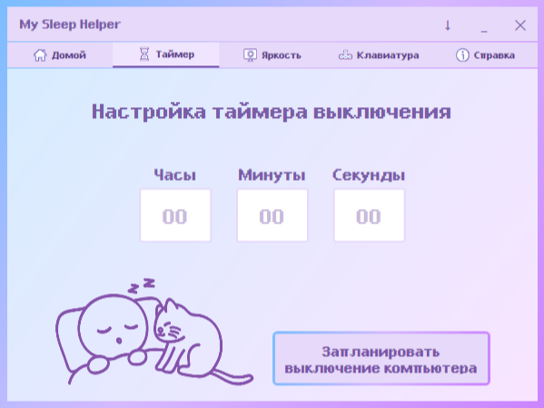

# 🌸 My Sleep Helper 🌸

## Описание проекта

My Sleep Helper — это приложение, созданное для помощи пользователям в создании комфортных условий для сна. Приложение предоставляет следующие функции:

- Автоматическое выключение компьютера через указанное время.
- Регулировка затемнения экрана для создания более комфортной среды для засыпания под любимые видео.
- Блокировка клавиатуры для защиты от случайных нажатий (например, котиками).

## О разработке

Это приложение было создано в процессе изучения C# и WPF. Мне самой нужен был удобный инструмент для подготовки ко сну, поэтому я реализовала: таймер выключения, регулировку яркости и блокировку клавиатуры от котиков, которые любят печатать, пока я сплю 😊

Надеюсь, оно окажется полезным и для других.

## Технические детали

- **Платформа**: Windows Desktop (WPF)
- **Язык программирования**: C#
- **Версия .NET**: .NET 8.0
- **IDE**: Visual Studio 2022
- **Язык интерфейса**: Русский
- **Архитектура**: x64
- **Минимальные системные требования**: Windows 10 или выше 

## 🐛 Сообщить об ошибке
Если приложение работает неправильно:
1. Создайте новое [сообщение об ошибке](https://github.com/chth-dev/MySleepHelperApp/issues/new/choose) на GitHub.
2. Опишите проблему (какие действия привели к ошибке).
3. Укажите версию приложения (ее можно найти в разделе "Справка").

## 📚 Документация

Подробная техническая информация и список использованных ресурсов: [DOCUMENTATION.md](DOCUMENTATION.md)

